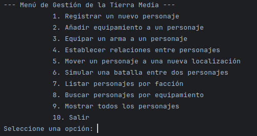
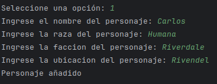
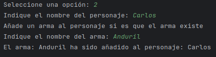
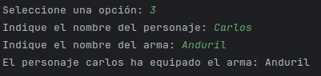
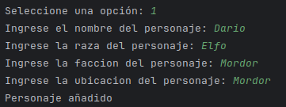
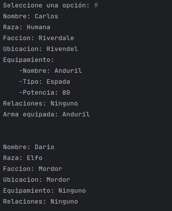
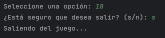

# Juego de la Tierra Media
## 4. Uso del menú interactivo
Para empezar, el menú funciona con un `match-case`, es decir, que para 
utilizar las diferentes funciones necesitas introducir el número
de la función que quieras utilizar.

### Explicación de las diversas funciones

| Nº función |Menú de Gestión de la Tierra Media |
|----|------------------------------------|
| 1  |Registrar un nuevo personaje |
| 2  |Añadir equipamiento a un personaje |
| 3  |Equipar un arma a un personaje|
| 4  |Establecer relaciones entre personajes|
| 5  |Mover un personaje a una nueva localización|
| 6  |Simular una batalla entre dos personajes|
| 7  |Listar personajes por facción|
| 8  |Buscar personajes por equipamiento|
| 9  |Mostrar todos los personajes|
| 10 |Salir|

* **La número 1** sirve para registrar un personaje con el que podemos interactuar
con las siguientes funciones.
* **La número 2** sirve para añadir equipamiento o arma al personaje.
* **La número 3** sirve para equiparle el arma añadida en la función anterior.
* **La número 4** sirve para establecer relaciones entre los personajes. 
Entre los tipos de relaciones está amigo, enemigo y neutral, y el nivel de
la relación del 1 al 10.
* **La número 5** sirve para mover a un personaje a otra ubicación
* **La número 6** sirve para simular una batalla entre dos personajes en el que
está involucrado el tipo de arma y la potencia para determinar quién ganaría
en esa batalla.
* **La número 7** sirve para mostrar los personajes de una determinada facción
introducida por el usuario.
* **La número 8** sirve para buscar todos los personajes que tienen un arma o
equipamiento específicos 
* **La número 9** muestra todos los personajes y sus datos: raza, facción,
ubicación, equipamiento que tiene en el inventario, relaciones y el arma
equipada.
* **La número 10** trata de salir del juego, pero antes le enseña una
pregunta para confirmar si quiere realmente salir del programa

### Ejemplo de uso

Cuando iniciamos el programa, lo primero que nos muestra es el menú con todas
las opciones y la descripción del funcionamiento de cada una, y nos solicita
que ingresemos el número correspondiente al acto que queramos hacer.

Creamos un personaje y le introducimos los datos.

Le damos un arma al personaje creado anteriormente.

Se la equipamos.

Añadimos otro nuevo personaje

Mostramos todos los personajes

Finalmente, salimos del juego y lo confirmamos.

## 5. Manejo de errores

## 6. Trabajo en equipo